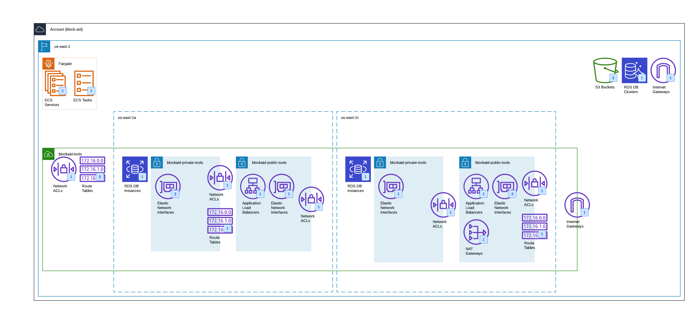

# SonarQube Terraform Module for AWS #

This Terraform module deploys a SonarQube community server on AWS. Based on official Sonarqube Docker image <https://hub.docker.com/_/sonarqube>.

## Usage

Check valid versions on:
* Github Releases: <https://github.com/cn-terraform/terraform-aws-sonarqube/releases>
* Terraform Module Registry: <https://registry.terraform.io/modules/cn-terraform/sonarqube/aws>

## Architecture
This deployment will create the following AWS services that require specific VPC requirements such as:
- 2 Availability Zones
- Public and Private Subnets

Thereform a Terraform script has been created to generate a VPC with these specific requirements located in GitHub at:
https://github.com/BLOCK-AID/terraform-vpc-tools

Once you have an AWS VPC available, the following services will be deploy along with the SonarQube Docker image:
- Aurora Postgres Cluster (Serverless RDS) with 2 instances
- Elastic Container Service (Serverless) using Fargate

The resulting architecture is shown below:

## Install pre commit hooks.

WHY?  The goal of pre-commit hooks is to improve the quality of commits. This is achieved by making sure your commits meet some (formal) requirements, e.g:

- that they comply to a certain coding style (with the hook style-files).
- that you commit derivatives such as README.md or .Rd files with their source instead of spreading them over multiple commits.
and so on.

As all changes enter a repository history with a commit, we believe many checks should be performed at that point, and not only later on a CI service. For example, creating auto-commits at a CI service for styling code creates unnecessary extra commits, as styling can be checked at the time of committing and is relatively inexpensive.

Please run this command right after cloning the repository.

        pre-commit install

For that you may need to install the folowwing tools:
* [Pre-commit](https://pre-commit.com/)
* [Terraform Docs](https://terraform-docs.io/)

In order to run all checks at any point run the following command:

        pre-commit run --all-files

<!-- BEGINNING OF PRE-COMMIT-TERRAFORM DOCS HOOK -->
## Requirements

| Name | Version |
|------|---------|
|  [terraform](#requirement\_terraform) | >= 0.13 |

## Providers

| Name | Version |
|------|---------|
|  [aws](#provider\_aws) | 4.2.0 |
|  [random](#provider\_random) | 3.1.0 |

## Modules

| Name | Source | Version |
|------|--------|---------|
|  [aws\_cw\_logs](#module\_aws\_cw\_logs) | cn-terraform/cloudwatch-logs/aws | 1.0.8 |
|  [ecs\_fargate](#module\_ecs\_fargate) | cn-terraform/ecs-fargate/aws | 2.0.30 |
|  [vpc](https://github.com/BLOCK-AID/terraform-vpc-tools) | BLOCK-AID/terraform-vpc-tools | n/a |

## Resources

| Name | Type |
|------|------|
| [aws_db_subnet_group.aurora_db_subnet_group](https://registry.terraform.io/providers/hashicorp/aws/latest/docs/resources/db_subnet_group) | resource |
| [aws_kms_key.encryption_key](https://registry.terraform.io/providers/hashicorp/aws/latest/docs/resources/kms_key) | resource |
| [aws_rds_cluster.aurora_db](https://registry.terraform.io/providers/hashicorp/aws/latest/docs/resources/rds_cluster) | resource |
| [aws_rds_cluster_instance.aurora_db_cluster_instances](https://registry.terraform.io/providers/hashicorp/aws/latest/docs/resources/rds_cluster_instance) | resource |
| [aws_security_group.aurora_sg](https://registry.terraform.io/providers/hashicorp/aws/latest/docs/resources/security_group) | resource |
| [random_password.master_password](https://registry.terraform.io/providers/hashicorp/random/latest/docs/resources/password) | resource |
| [aws_security_group.default](https://registry.terraform.io/providers/hashicorp/aws/latest/docs/data-sources/security_group) | data source |

## Inputs

| Name | Description | Type | Default | Required |
|------|-------------|------|---------|:--------:|
|  [db\_engine\_version](#input\_db\_engine\_version) | DB engine version | `string` | `"12.10"` | no |
|  [db\_instance\_size](#input\_db\_instance\_size) | DB instance size | `string` | `"db.r5.large"` | no |
|  [db\_name](#input\_db\_name) | Default DB name | `string` | `"sonar"` | no |
|  [db\_password](#input\_db\_password) | DB password | `string` | `""` | no |
|  [db\_username](#input\_db\_username) | Default DB username | `string` | `"sonar"` | no |
|  [name\_prefix](#input\_name\_prefix) | Name prefix for resources on AWS | `string` | n/a | yes |
|  [region](#input\_region) | AWS Region the infrastructure is hosted in | `string` | n/a | yes |
|  [sonarqube\_image](#input\_sonarqube\_image) | Sonarqube image | `string` | `"sonarqube:lts"` | no |
|  [tags](#input\_tags) | Resource tags | `map(string)` | `{}` | no |

## Outputs

| Name | Description |
|------|-------------|
|  [sonar\_lb\_arn](#output\_sonar\_lb\_arn) | SonarQube Load Balancer ARN |
|  [sonar\_lb\_arn\_suffix](#output\_sonar\_lb\_arn\_suffix) | SonarQube Load Balancer ARN Suffix |
|  [sonar\_lb\_dns\_name](#output\_sonar\_lb\_dns\_name) | SonarQube Load Balancer DNS Name |
|  [sonar\_lb\_id](#output\_sonar\_lb\_id) | SonarQube Load Balancer ID |
|  [sonar\_lb\_zone\_id](#output\_sonar\_lb\_zone\_id) | SonarQube Load Balancer Zone ID |
<!-- END OF PRE-COMMIT-TERRAFORM DOCS HOOK -->
